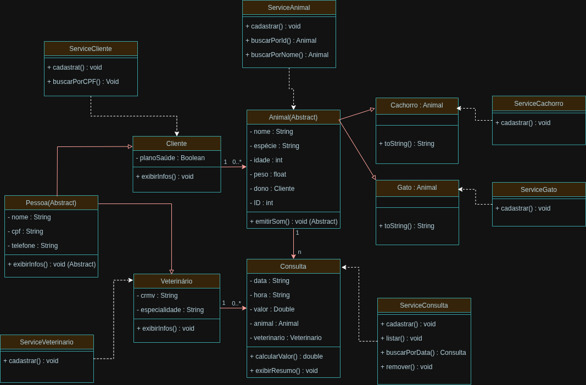

# 🐾 Sistema de Clínica Veterinária - DogTech

Projeto desenvolvido para a disciplina **Linguagem de Programação Orientada a Objetos (LPOO)**.  
O objetivo é aplicar os conceitos de **Programação Orientada a Objetos (POO)** em Java, criando um sistema de gerenciamento aplicando os conceitos fundamentais de LPOO.

---

## 📚 Objetivos do Projeto

- O cadastro das entidades principais, por exemplo, produtos, clientes,
quartos, reservas, empréstimos, batalhas, locações, etc.

- Gerenciar os relacionamentos entre essas entidades, por exemplo,
vendas, reservas, empréstimos, batalhas, locações, etc.

- Consultar informações relevantes do sistema, como itens disponíveis,
histórico de operações, saldo, estatísticas, etc.

- Executar regras específicas que diferenciem os tipos de entidades, por
exemplo, limites, descontos, poderes, categorias, etc.

---

## 👨‍🔧 Requisitos Técnicos

1. O sistema deve conter pelo menos 4 classes
2. Utilizar encapsulamento (atributos privados + getters e setters)
3. Possuir construtores
4. Utilizar herança para diferenciar tipos de entidades
5. Demonstrar polimorfismo (por meio de sobrescrita de métodos, tipos de
retorno ou parâmetros de métodos)
6. Utilizar ao menos uma classe abstrata ou interface
7. Usar coleções genéricas (list, set ou map) para armazenar objetos
8. Ter um menu interativo em console que permita ao usuário testar todas
as funcionalidades
9. Entregar também um diagrama UML, representando a estrutura das
classes
10. Realizar um vídeo onde o grupo apresenta o trabalho desenvolvido
em funcionamento

---

### Descrição dos pacotes:

- **model/** → Contém as classes do domínio (entidades).
- **service/** → Regras de negócio e manipulação de dados.
- **util/** → Classes auxiliares, como leitura de input do usuário.
- **Main.java** → Classe principal que inicia o programa e exibe o menu.

---

## ⚙️ Como Executar o Projeto

### Passos
1. Clone o repositório:
  git clone https://github.com/seu-usuario/nome-do-repositorio.git
2. Acesse a pasta do projeto:
  cd nome-do-repositorio
3. Compile o projeto:
  javac -d bin src/**/*.java
4. Execute o programa:
  java -cp bin Main

---

## 📊 Diagrama UML

